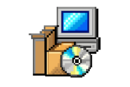
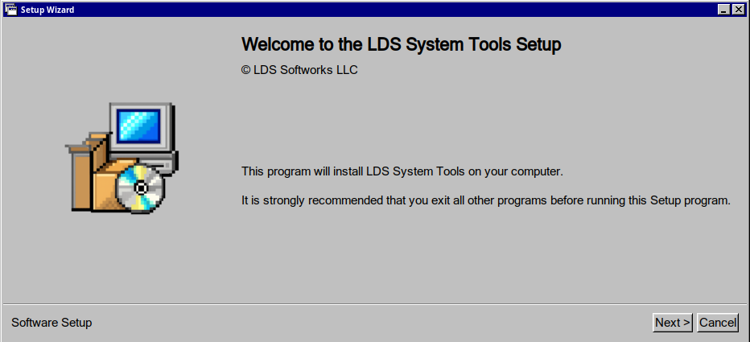
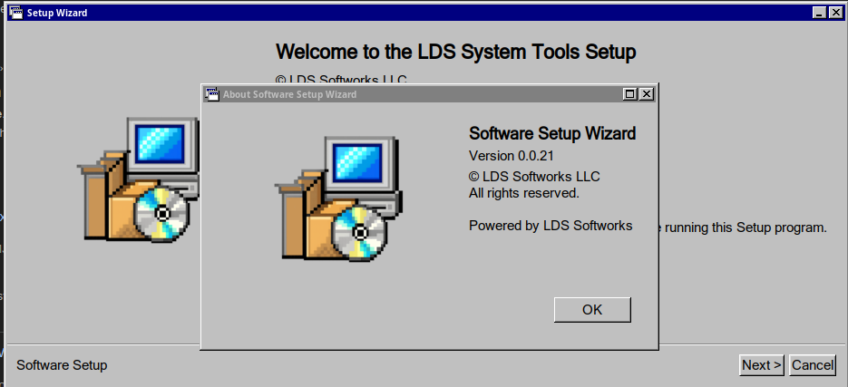

# LDS Softworks - Software Setup Wizard


A straightforward software installer (premade script) for Linux built with GTK++. This tool allows for quick deployment by configuring a simple text file and organizing your application binaries.

## Build Requirements:
- Binutils Dependency
- Bash
- GTKMM (GTK++)
- pkgconfig
- make

### Debian Build From Source Instructions
- Open a command prompt
- Navigate using CD to the project repository's directory
- install the required dependencies by running `make init`
- run the `make setup` or `make all` command to build the output binary.
> Note, this build process is generally fast, but it is recommended that the bash command is preceded by the `time` command if you want to know the exact build times.

## Configuration

To define how the installer behaves, modify the values in the `setup.conf` file.

1. **Binaries**: Place your software's executable and supporting files inside the `Binary/` directory.
   * *Note: The path is relative to `INSTDIR`. Maintain your required directory structure inside this folder.*
2. **Icons**: Place your application icons inside the `Icons/` directory.

## setup.conf Reference

The `setup.conf` file contains all the variables the Wizard needs to process the installation.

### Identity & UI
* **`PROGNAME`**: The name of your program (unquoted) to be displayed during installation.
* **`ICON`**: Points to the image the Setup will show on the main screen. Defaults to `Icons/SetupWizardIcon.png` if not specified.
* **`LICENSEFILE`**: Sets the license file to include with the Setup's UI (LDS-SSWv0.0.22)
* **`HASCOPYRIGHT`**: Set to `True` to display a copyright notice.
* **`COPYHOLDER`**: The name of the copyright holder (e.g., "Your Company Name"). Recommended if `HASCOPYRIGHT` is True.

### Installation Logic

* **`DEFINSTTYPE`**: Defines the permission level.
    * `User`: Installs to a path relative to `$HOME`.
    * `Global`: Installs to `/usr/bin`. This will trigger a request for ROOT/sudo access.
* **`DEFINSTDIR`**: The default path suggested to the user (relative to `$HOME` in User mode).
* **`MKDIR`**: Boolean. If `True`, the Wizard will create the directory specified in `INSTDIRNAME`.
* **`INSTDIRNAME`**: The name of the directory to be created for your application files.

### Post-Installation

* **`MAINBINNAME`**: The filename of the binary that launches your application.
   * *Critical: If this is empty, the "Open Program" button will fail after installation.*
* **`HASREADME`**: Set to `True` if your software includes a README file.
* **`READMEFILE`**: The specific filename (e.g., `README.md`) to be opened if `HASREADME` is True.
* **`SYMLINKFILES`**: If `True`, the installer attempts to symlink binaries to `/usr/bin` or `$HOME/System/Public/Programs`.
* **`ASKIFOPENONEND`**: If `True`, prompts the user to launch the software immediately after the setup finishes.

### Extra Software and Opt-In Features (Beta)

* **`HASOPTINFEATURES`**: If `True`, it enables the "Opt-In-Feature Selection" Page, which will show a list of opt-in features from the defined `FEATURELISTFILE`
* **`OPTINDIR`**: Contains the relative path to your opt-in-features files, including the [Opt-In Features List](OPTIN/features.conf) specified by you.

* **`FEATURELISTFILE`**: This points to your features list file, which must include a list of the included extra features provided by your software (these are shown in the same order as in the file, so, keep it organized.)

>> For information about the FEATURELIST file syntax, please review the [Optional Features TOML Syntax](OPTIN/README.md) guide.

## Directory Structure

The LDS-SSW expects the following layout:

```text
.
├── Binary/          # Your application files/binaries
├── Icons/           # Your application/setup icon
├── setup.conf       # Your configuration file
└── setup            # The installer executable
```
> **Note**: The Icons/ directory is for the installer's use only. These files are not copied to the final installation directory unless they are also placed inside the Binary/ folder.

## How does the UI Look?
A properly configured Installer can look like the following:
(Software Setup Wizard | Running in Lubuntu Linux w/[Chicago95 Theme](https://github.com/grassmunk/Chicago95))



One can also access a "About This Software" through the F2 Key on your keyboard, which would bring the following UI element:


___

# Get the Setup Wizard Shield's latest version:

There's two sources from which you can download the setup shield's Setup Files, either through the softworks website, or the Github Repo's source.

## What's the difference?

The Softworks provided download link does not include the Setup Wizard Source, but just the setup's executable file and its related configs (as well as a example license and explanations on the directories)

The Github provided ZIP Archive is always up to date, and provides the Setup Wizard's Source Code for people who want to customize how the setup shield looks like (Which might take more disk space)

Regardless of which version you choose, the Setup Shield offers (mostly) the same features on both download sources (though the Softworks' Website provided one, hosts only the Lastest-Known-Working setup templates).

[Website Download (Just the Setup Shield and a basic config) ](https://softworks.aizawallc.org/LDS%20Software%20Setup%20Shield)

[Github Download (Includes Source Code and build files)](https://github.com/jossgamerYT156/LDS-Software-Setup-Wizard/archive/refs/heads/main.zip)